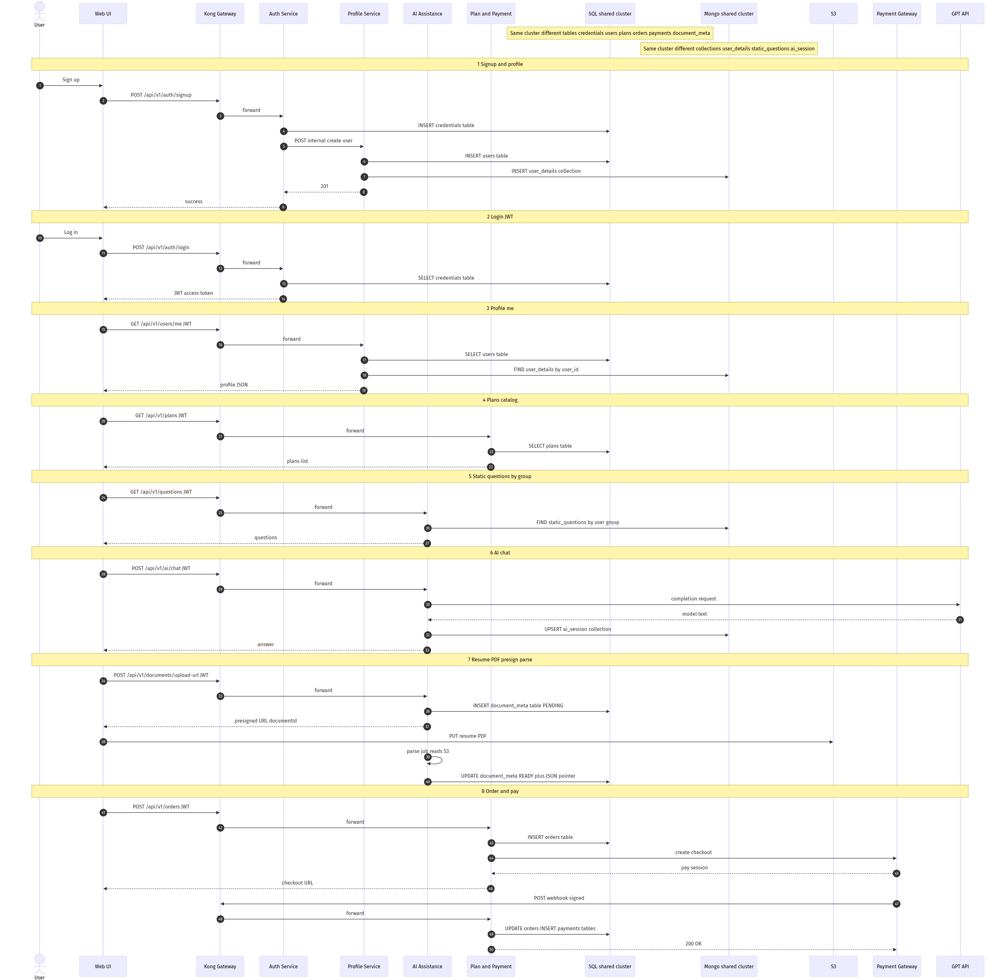
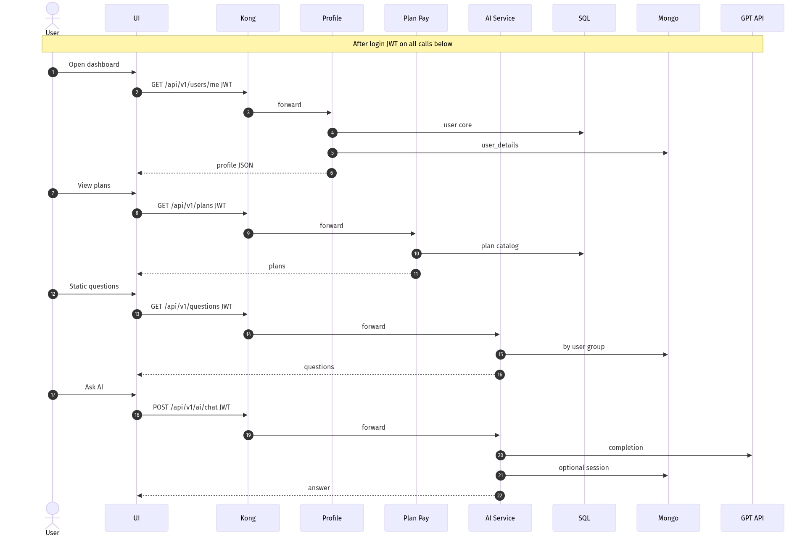
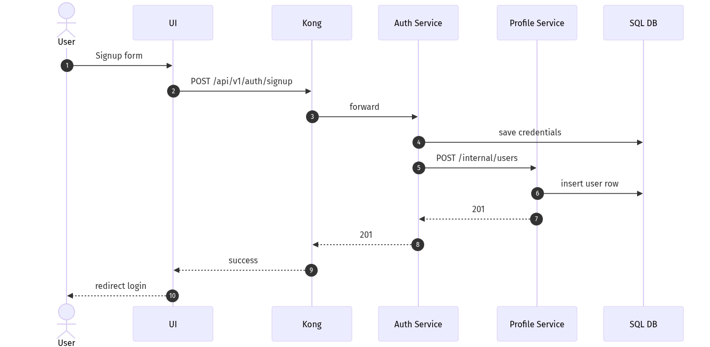
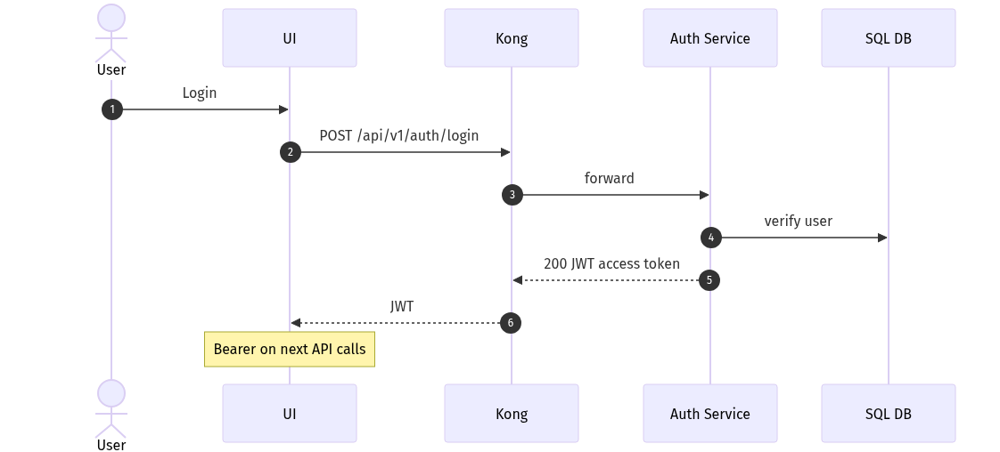
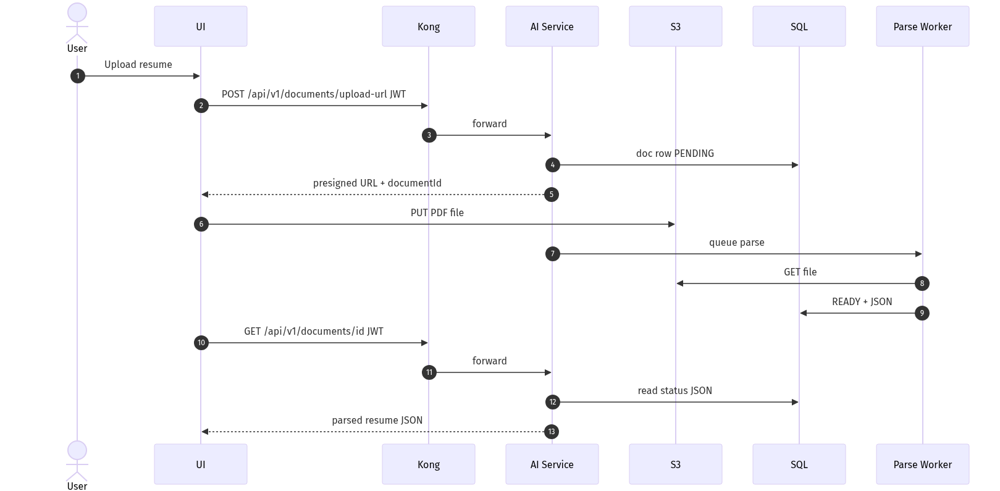
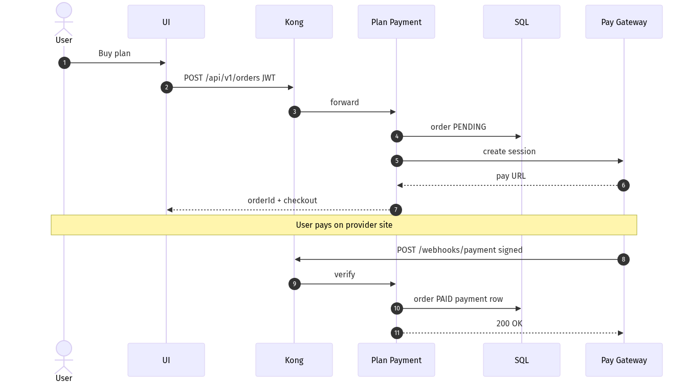
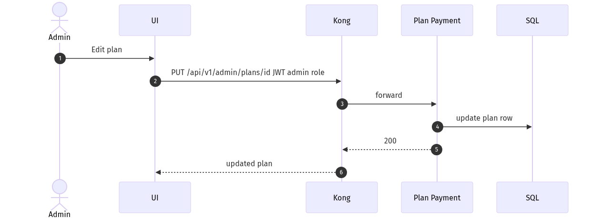

# API flows & sequence diagrams (with HLD components)

**Purpose:** Show **how HTTP/API calls move** across the same components as the HLD (UI → Kong → services → DB / S3 / externals).  
**Companion:** [ARCHITECTURE-HLD.md](./ARCHITECTURE-HLD.md) (structure); [API-CONTRACTS.md](./API-CONTRACTS.md) (auth + every external/internal API); [EXTERNAL-API-REFERENCE-UI.md](./EXTERNAL-API-REFERENCE-UI.md) (UI samples); [INTERNAL-API-REFERENCE.md](./INTERNAL-API-REFERENCE.md) (internal Basic samples); OpenAPI specs (exact schemas).

**Last updated:** 2026-03-19

**Diagrams:** PNG images render in any viewer. Sources: [`diagrams/source/`](./diagrams/source/) — regenerate with [`diagrams/README.md`](./diagrams/README.md).

---

## Master sequence — all services in one flow (shared DB clusters)

Single end-to-end sequence: **Auth**, **Profile**, **AI**, **Plan & Payment**, plus **S3**, **Payment Gateway**, and **GPT**.

**Databases:** one **SQL** deployment/cluster and one **Mongo** deployment/cluster — services use **different tables / collections**, not separate database clusters per service.



*Source:* [`diagrams/source/seq-all-services-unified.mmd`](./diagrams/source/seq-all-services-unified.mmd)

The sections below break the same ideas into **smaller** diagrams for readability.

---

## Why not only Mermaid in Markdown?

Many tools don’t render ` ```mermaid ` blocks (or they’re hard to read). **PNG figures** stay visible in GitHub, VS Code, Word/PDF, and printouts.

---

## HLD + API: authenticated user journey (multi-service)

One sequence showing **several API calls** after login, mapped to **Profile**, **Plan & Payment**, and **AI** (matches HLD boxes).



Example paths (align with your OpenAPI):

| Step | API (via Kong) | Service |
|------|----------------|---------|
| Profile | `GET /api/v1/users/me` | User Profile |
| Plans | `GET /api/v1/plans` | Plan & Payment |
| Static questions | `GET /api/v1/questions` | AI Assistance |
| Chat | `POST /api/v1/ai/chat` | AI Assistance |

---

## Sequence: Signup (Auth + Profile)



---

## Sequence: Login + JWT



---

## Sequence: Resume upload (S3) + parse + GET JSON



---

## Sequence: Create order + payment + webhook



---

## Sequence: Admin update plan



---

## Kong routing map (fill in)

| Method | Path (external) | Auth | Upstream service | Notes |
|--------|-----------------|------|------------------|-------|
| POST | `/api/v1/auth/signup` | none | auth-service | |
| POST | `/api/v1/auth/login` | none | auth-service | |
| GET | `/api/v1/users/me` | JWT | user-profile-service | |
| GET | `/api/v1/plans` | JWT or public | plan-payment-service | |
| GET | `/api/v1/questions` | JWT | ai-assistance-service | By user group |
| POST | `/api/v1/ai/chat` | JWT | ai-assistance-service | |
| POST | `/api/v1/documents/upload-url` | JWT | ai-assistance-service | |
| GET | `/api/v1/documents/{id}` | JWT | ai-assistance-service | |
| POST | `/api/v1/orders` | JWT | plan-payment-service | |
| POST | `/api/v1/webhooks/payment` | signature | plan-payment-service | No JWT; verify HMAC |
| PUT | `/api/v1/admin/plans/{id}` | JWT + admin | plan-payment-service | |

---

## Other diagram types (when needed)

- **Swimlane:** async worker + retries (heavy PDF, webhook retries).
- **State machine:** order/document status (`PENDING` → `PAID` / `FAILED`).
- **OpenAPI 3:** all paths, bodies, and error codes.

---

## Maintenance

- Edit **`docs/diagrams/source/*.mmd`**, regenerate **`.png`** into `docs/diagrams/png/`, commit both.
- When real routes differ from examples, update **this table** and the **`.mmd`** text on arrows.

---

## See also

- [ARCHITECTURE-HLD.md](./ARCHITECTURE-HLD.md) — HLD with architecture PNGs  
- [diagrams/README.md](./diagrams/README.md) — regenerate PNGs  
- [README.md](./README.md) (index), [api-contract-static.html](./api-contract-static.html), [postman/](./postman/)
