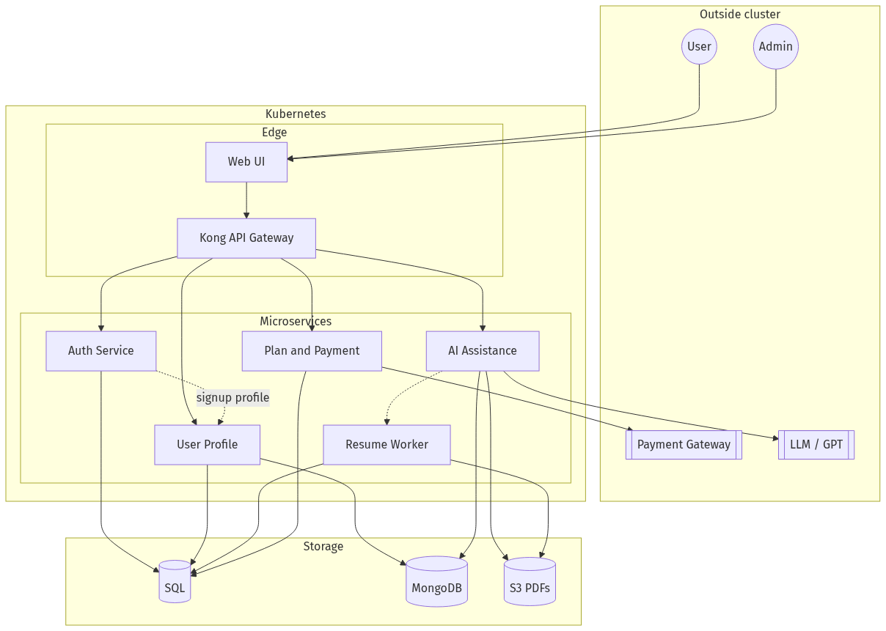
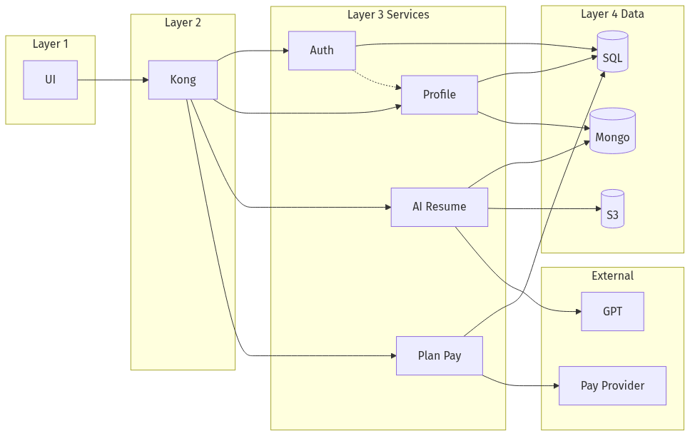
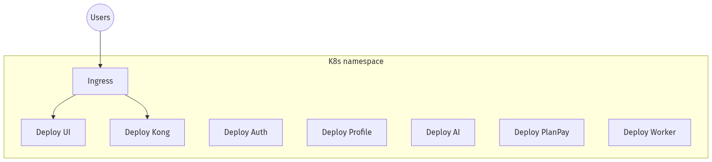

# High-Level Design (HLD) — AiTechTap Core

| | |
|--|--|
| **Document** | Master architecture overview (structure, flows, diagrams, doc index) |
| **Audience** | Engineering, product, UI/backend leads, DevOps |
| **Last updated** | 2026-03-19 |
| **Location** | `docs/ARCHITECTURE-HLD.md` |

**This file is the recommended entry point** for architecture. Deeper detail lives in linked documents below.

---

## Table of contents

1. [Purpose & scope](#1-purpose--scope)  
2. [Architecture documentation map](#2-architecture-documentation-map)  
3. [Product intent (summary)](#3-product-intent-summary)  
4. [Target runtime (Kubernetes)](#4-target-runtime-kubernetes)  
5. [Structural diagrams (containers & layers)](#5-structural-diagrams-containers--layers)  
6. [End-to-end & API flow diagrams (sequences)](#6-end-to-end--api-flow-diagrams-sequences)  
7. [Resume / PDF & AI (concept)](#7-resume--pdf--ai-concept)  
8. [Static questions by user group](#8-static-questions-by-user-group)  
9. [Data ownership](#9-data-ownership)  
10. [Key flows (checklist)](#10-key-flows-checklist)  
11. [Security & API surfaces (pointers)](#11-security--api-surfaces-pointers)  
12. [Design principles & risks](#12-design-principles--risks)  
13. [Diagram assets index](#13-diagram-assets-index)  
14. [Repository & tooling links](#14-repository--tooling-links)  

---

## 1. Purpose & scope

This HLD describes:

- **Logical architecture:** UI → Kong → microservices → SQL / Mongo / S3 → external payment & LLM.  
- **Deployment intent:** components run in **Kubernetes**; internal service traffic is **not** routed through Kong.  
- **Visuals:** embedded **PNG diagrams** (viewable in GitHub, VS Code, PDF export).  
- **Pointers** to contracts, API references, data model, and operational docs.

**Out of scope here:** per-field OpenAPI schemas (use Swagger / OpenAPI export and [EXTERNAL-API-REFERENCE-UI.md](./EXTERNAL-API-REFERENCE-UI.md)).

---

## 2. Architecture documentation map

Use this table to find the right document. All paths are under **`docs/`**.

| Document | Purpose |
|----------|---------|
| **[README.md](./README.md)** | Folder index, product brief, sharing guidance |
| **[ARCHITECTURE-HLD.md](./ARCHITECTURE-HLD.md)** *(this file)* | Master HLD: diagrams, scope, doc map |
| **[API-FLOWS.md](./API-FLOWS.md)** | Sequence diagrams (PNG), Kong routing table |
| **[API-CONTRACTS.md](./API-CONTRACTS.md)** | **Normative:** external JWT, internal Basic, Kong vs `/internal/*` |
| **[EXTERNAL-API-REFERENCE-UI.md](./EXTERNAL-API-REFERENCE-UI.md)** | **UI:** public endpoints — headers, bodies, samples |
| **[INTERNAL-API-REFERENCE.md](./INTERNAL-API-REFERENCE.md)** | **Backend:** `/internal/v1/*`, Basic Auth, samples |
| **[DATA-MODEL-AND-ENTITIES.md](./DATA-MODEL-AND-ENTITIES.md)** | Tables, collections, entities |
| **[GETTING-STARTED.md](./GETTING-STARTED.md)** | Gradle, Spotless, run app, Swagger |
| **[DOCKER-K8S-PLAN.md](./DOCKER-K8S-PLAN.md)** | Docker & Kubernetes plan |
| **[api-contract-static.html](./api-contract-static.html)** | Static HTML API pages |
| **[postman/CURL_EXAMPLES.md](./postman/CURL_EXAMPLES.md)** | cURL examples |
| **[diagrams/README.md](./diagrams/README.md)** | Regenerate diagram PNGs |

**Suggested reading order**

1. This HLD (structure + diagrams)  
2. [API-CONTRACTS.md](./API-CONTRACTS.md) (auth rules)  
3. [EXTERNAL-API-REFERENCE-UI.md](./EXTERNAL-API-REFERENCE-UI.md) or [INTERNAL-API-REFERENCE.md](./INTERNAL-API-REFERENCE.md) by role  
4. [DATA-MODEL-AND-ENTITIES.md](./DATA-MODEL-AND-ENTITIES.md) when implementing persistence  

---

## 3. Product intent (summary)

- **Users:** signup/login (**JWT**), profile, plans, payments, AI chat, career suggestions; **resume/PDF** upload → parse → JSON (planned/ evolving).  
- **Admins:** plan configuration (**PUT** plan, etc.) — today may be Basic on `/api/admin/plans`; target internal Basic per [API-CONTRACTS.md](./API-CONTRACTS.md).  
- **Kong** is the **single public API entry** from clients.  
- **Registration:** **`POST /api/auth/signup`** creates **credentials** and **registers** the user (`user_core` + `user_profiles`) in one step; **`POST /api/users`** with JWT **updates details only**. See [DATA-MODEL-AND-ENTITIES.md](./DATA-MODEL-AND-ENTITIES.md).  
- **Services:** Authentication, User Profile, AI Assistance, Plan & Payment (+ optional resume worker).  
- **Persistence:** **SQL** for structured data; **Mongo** for flexible profile and AI-related documents; **S3** for PDF binaries.  
- **Google / social signup:** not in scope for now.

---

## 4. Target runtime (Kubernetes)

| Component | Placement |
|-----------|-----------|
| Web UI | K8s Deployment + Service; exposed via **Ingress** |
| Kong API Gateway | K8s |
| Microservices (Auth, Profile, AI, Plan & Payment) | K8s — one Deployment per service |
| SQL database | Managed or in-cluster |
| MongoDB | Managed or in-cluster |
| Amazon S3 | Object storage (resumes) |
| External payment gateway | SaaS (e.g. Razorpay-compatible) |
| LLM | External API (e.g. GPT) |

**Optional:** async **resume parse worker** (queue + Deployment/CronJob).

---

## 5. Structural diagrams (containers & layers)

*Sources: [`diagrams/source/hld-*.mmd`](./diagrams/source/) — regenerate PNGs via [`diagrams/README.md`](./diagrams/README.md).*

### 5.1 System context & containers

Actors, Kong, services, data stores, and external systems.

### 5.2 Layered view

Presentation → API gateway → domain services → persistence → external integrations.

### 5.3 Kubernetes deployables (conceptual)

Ingress and Deployments for UI, Kong, Auth, Profile, AI, Plan & Payment, worker.

---

## 6. End-to-end & API flow diagrams (sequences)

*Full journey breakdowns and Kong routing table: **[API-FLOWS.md](./API-FLOWS.md)**.*

### 6.1 Master sequence — all services + shared DB clusters

One diagram covering signup, login, profile, plans, questions, AI chat, resume, payment + webhook. **SQL** and **Mongo** are **shared clusters** with different tables/collections per domain.

### 6.2 Authenticated user — multi-service API overview

After login: profile, plans, static questions, AI chat (example paths in [API-FLOWS.md](./API-FLOWS.md)).

### 6.3 Signup (Auth + Profile)

### 6.4 Login + JWT

### 6.5 Resume — presigned S3, parse, GET JSON

### 6.6 Payment — order, gateway, webhook

### 6.7 Admin — update plan

---

## 7. Resume / PDF & AI (concept)

1. Client gets **presigned S3 URL** → uploads PDF.  
2. **Metadata** in DB: `document_id`, `user_id`, S3 location, **status**.  
3. **Parser** produces **JSON** (API or worker).  
4. Client **GET** by `document_id` for status + JSON.  

**AI Assistance** covers: S3, parsing, **static questions by user group**, GPT-backed chat. Details: [DATA-MODEL-AND-ENTITIES.md](./DATA-MODEL-AND-ENTITIES.md) (planned `document_meta`), [EXTERNAL-API-REFERENCE-UI.md](./EXTERNAL-API-REFERENCE-UI.md) §19 (planned routes).

---

## 8. Static questions by user group

- Store sets in **DB** (SQL or Mongo) so ops can change without deploy.  
- Resolve **user group** from profile → load question set.  
- See [DATA-MODEL-AND-ENTITIES.md](./DATA-MODEL-AND-ENTITIES.md) §4.2 (AI collections).

---

## 9. Data ownership

| Store | Typical contents |
|-------|------------------|
| **SQL** | `credentials`, `user_core`, `plan`, `orders`, `payments`, resume **metadata** / `document_meta` (planned) |
| **Mongo** | `user_profiles`, static questions, AI session / Q&A |
| **S3** | Raw PDFs |

**Same physical cluster, logical separation:** one Postgres and one Mongo deployment with **different tables/collections** per service boundary — see [DATA-MODEL-AND-ENTITIES.md](./DATA-MODEL-AND-ENTITIES.md) §1–2.

---

## 10. Key flows (checklist)

| # | Flow | Detail |
|---|------|--------|
| 1 | Auth | UI → Kong → Auth → credentials → **JWT** |
| 2 | Signup | Credential + **user provision** (in-process or [internal API](./INTERNAL-API-REFERENCE.md) §1) |
| 3 | Profile | Kong → Profile → SQL + Mongo |
| 4 | Resume | Presign → S3 → parse → DB |
| 5 | Static Q | User group → questions ([planned external](./EXTERNAL-API-REFERENCE-UI.md) §19) |
| 6 | Pay | Kong → Plan & Payment → SQL; **webhook** authoritative |

**Sequence PNGs:** [§6](#6-end-to-end--api-flow-diagrams-sequences) above · **Step-by-step tables:** [API-FLOWS.md](./API-FLOWS.md)

---

## 11. Security & API surfaces (pointers)

| Surface | Auth | Document |
|---------|------|----------|
| Public APIs (via Kong) | **Bearer JWT**; public auth routes | [API-CONTRACTS.md](./API-CONTRACTS.md) §2, §4 · [EXTERNAL-API-REFERENCE-UI.md](./EXTERNAL-API-REFERENCE-UI.md) |
| Service-to-service | **HTTP Basic**; path `/internal/v1/*`; **not** on Kong | [API-CONTRACTS.md](./API-CONTRACTS.md) §3, §5 · [INTERNAL-API-REFERENCE.md](./INTERNAL-API-REFERENCE.md) |
| Payment webhook | Provider **signature** | [API-CONTRACTS.md](./API-CONTRACTS.md) §6 · [EXTERNAL-API-REFERENCE-UI.md](./EXTERNAL-API-REFERENCE-UI.md) §16 |

**User id:** from JWT claim **`sub`** for all user-scoped external calls — see [API-CONTRACTS.md](./API-CONTRACTS.md).

---

## 12. Design principles & risks

- **Idempotency** on orders and payment confirmation; trust **webhooks** where applicable.  
- **Correlation / trace IDs** from Kong through services.  
- **`plan_id` / subscription:** single source of truth vs profile denormalization — align in billing vs user service.  
- **JWT:** minimal claims; admin **roles/scopes** if admin routes stay external.  
- **AI / PDF:** quotas, timeouts, **PII** handling for logs and storage.

---

## 13. Diagram assets index

| PNG file | Source (edit & regenerate) | What it shows |
|----------|----------------------------|----------------|
| `hld-system-context.png` | `diagrams/source/hld-system-context.mmd` | Full system context |
| `hld-layered.png` | `diagrams/source/hld-layered.mmd` | Layered architecture |
| `hld-kubernetes.png` | `diagrams/source/hld-kubernetes.mmd` | K8s Deployments + Ingress |
| `seq-all-services-unified.png` | `diagrams/source/seq-all-services-unified.mmd` | One sequence — all services + shared DBs |
| `seq-authenticated-overview.png` | `diagrams/source/seq-authenticated-overview.mmd` | JWT user journey across services |
| `seq-signup.png` | `diagrams/source/seq-signup.mmd` | Signup |
| `seq-login-jwt.png` | `diagrams/source/seq-login-jwt.mmd` | Login |
| `seq-resume-s3.png` | `diagrams/source/seq-resume-s3.mmd` | Resume / S3 / parse |
| `seq-payment-webhook.png` | `diagrams/source/seq-payment-webhook.mmd` | Order + webhook |
| `seq-admin-plan.png` | `diagrams/source/seq-admin-plan.mmd` | Admin plan update |

**Regenerate all PNGs:** [diagrams/README.md](./diagrams/README.md)

---

## 14. Repository & tooling links

| Resource | URL / path |
|----------|------------|
| OpenAPI JSON (running app) | `GET /v3/api-docs` on app base URL |
| Swagger UI (running app) | `/swagger-ui/index.html` |
| Doc index & product brief | [README.md](./README.md) |
| Postman / cURL | [postman/](./postman/) |
| Getting started (build/run) | [GETTING-STARTED.md](./GETTING-STARTED.md) |
| Docker / K8s plan | [DOCKER-K8S-PLAN.md](./DOCKER-K8S-PLAN.md) |
| Static API HTML | [api-contract-static.html](./api-contract-static.html) |

---

*Update this HLD when service boundaries, data stores, or major flows change; keep [API-CONTRACTS.md](./API-CONTRACTS.md) and API reference docs in sync.*
